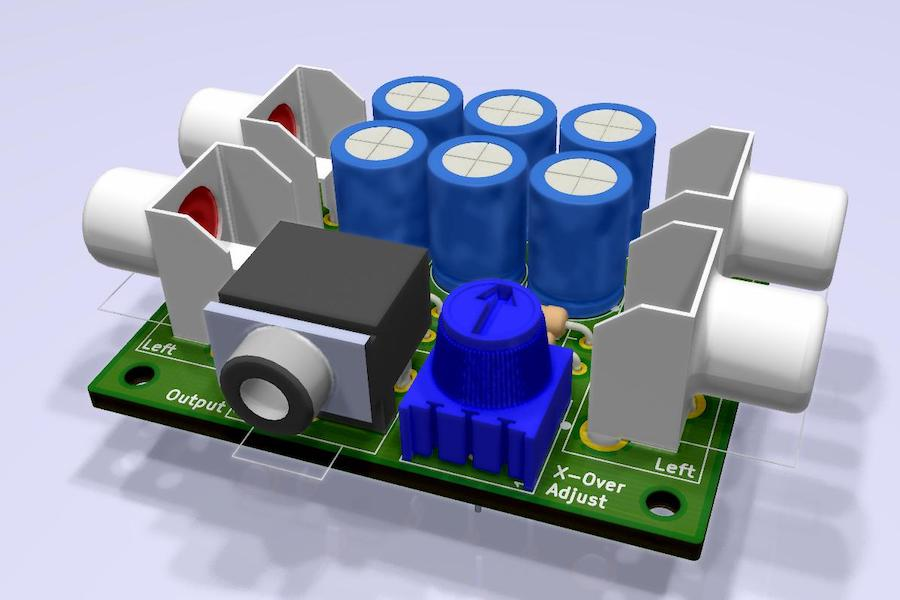

# AmigaStereoMixer

A simple circut to allow merging stereo input channels.
It is intended to make Amiga stereo output more enjoyable via headphones.
The Amiga outputs 4 voices, 2 on each stereo channel with total separation.
This project intends to cross-fade left and right channels to keep the
separation, but have a little of each channel bleed over to the other side.

*Notice:* This is a hobby project and I will not be responsible for any damage
that might result from its use!

There is a second input, in case that comes in handy for something.

Inspired by [Ms Mad Lemon's YouTube video](https://www.youtube.com/watch?v=cg2SPF7CMwM) about the same topic.
