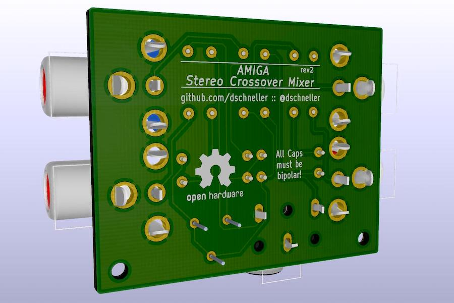

# AmigaStereoMixer

A simple circut to allow merging stereo input channels.

## What is it good for?
While the Commodore Amiga has great audio capabilities, normally their stereo output is not always enjoyable via headphones. This is because the Amiga outputs 4 voices, where 2 are mapped to each stereo channel. However, the left and right stereo channels are competely separated.  As long as the left and right speakers are close to each other (as in most TVs and
monitors of the time), this does not matter, because sound from both speakers reaches both ears.

When listening with headphones, though, there is no way for sound from the left channel to reach the right ear and vice versa. This often feels very unnatural, because, for example all percussion instruments might be on the right, while the melody is only getting to the left ear. 

This little board allows cross-fading the left and right channels to keep the separation, but have a little of each channel bleed over to the other side.

## How did it come about?

I [bought and refurbished an old Amiga 500](http://www.danielschneller.com/search/label/amiga) in December 2017.

Most of the time, I play games on it with headphones, because my modern monitor does not have built-in speakers and I did not want to clutter my desk with a pair of active external speakers. So I looked around to see if there were any readily available solutions first, but when I came across [Ms Mad Lemon's YouTube video](https://www.youtube.com/watch?v=cg2SPF7CMwM) about the same topic I thought it could be a fun first project to play with KiCad and create my first custom PCB.

## What does it look like?

The initial version was a little bigger and had a missing trace, making the adjustment knob do nothing, but that was easily fixed with a little piece of wire. So I designed a second revision, which is also quite a bit smaller, because the components are more densely packed. 

## How does it work?

There is two sets of input RCA jacks. The second one is completely optional and only there, because Ms Mad Lemon's had it, too. I just used the resistor and capacitor values she had already tried. I did, however, use bipolar caps instead of pairs of polarized ones back to back.
The left and right channels of both inputs get mixed together first. They then go through the variable resistor which decides how much of the left channel can bleed through to the right and vice versa.  

Finally, the mixed output goes to a TRS headphone jack.

Because this whole thing is completely passive, the output volume will be slightly reduced, compared to what you would get when connecting headphones directly. In my experience, though, it is not noticable.

## How to build it

Clone this repository and open the PCB file with KiCad. I created this with version 5.1, so use that least that. I assume, newer versions will be able to read this, too. 

### PCB

To get the PCB, you can upload either the KiCad PCB file directly to a manufacturer that supports it, or, if they don't, "plot" Gerber files for all the layers and drill holes with KiCad and then upload those. I won't go into the details, because there is a ton of documentation on that on the internet. 

### Components

For the capacitors, I chose Nichicon 47uF 16V 85°C. Make sure they are bipolar. The audio jacks for input (RCJ-012) and output (SJ1-3553NG) are from CUI Devices. The trimmer is a Bourns Inc. 3386F-1-102TLF. 10Ω resistors I had flying around from a resistor kit I bought a while ago. I ordered them everything from DigiKey, trying to get the cheapest options.

## Issues

* The trimmer I used is a linear 0-1㏀ model. While it works, audible changes in the amount of fading only happen in about the first 20% of a turn. Probably a variable resistor with a non-linear curve would yield better results. 

* I think I will change the 2nd pair of input jacks to an output. That way you would have to use a headphone or another adapter. That's probably more useful than a second input to be mixed in with the Amiga sound.

## Disclaimer

This is a hobby project and I will not be responsible for any damage that might result from its use! I am neither an audio nor hardware specialist. While I tried to do my best and don't think it is very difficult to build, it is up to you to decide whether you want build one for yourself and dare to connect it to your devices :-)

## License

Licensed under the [CERN Open Hardware License v1.2](cern_ohl_v_1_2.txt).
